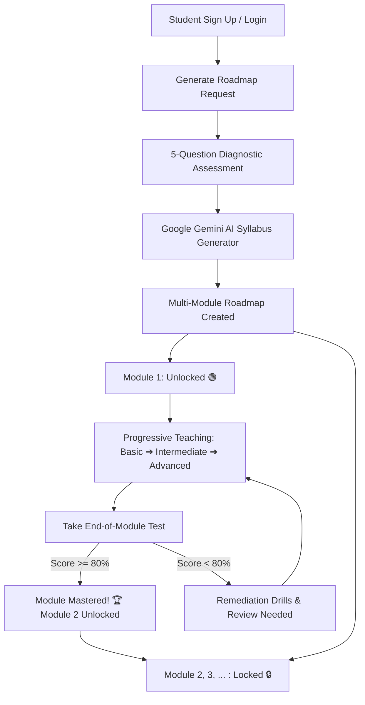

# StudyGen — AI-Powered Intelligent Learning & Mastery Platform

[](https://adoptium.net/)
[](https://spring.io/projects/spring-boot)
[](https://spring.io/projects/spring-ai)
[](https://react.dev/)
[](https://vitejs.dev/)
[](https://www.postgresql.org/)
[](https://www.docker.com/)
[](https://ai.google.dev/)

**StudyGen** is an end-to-end, AI-powered learning and skill-progression platform. It evaluates a student's baseline aptitude with an intelligent diagnostic test, generates personalized multi-module roadmaps, delivers structured teaching from fundamentals to production-grade engineering, gates module progression with an 80% passing threshold, and provides a focused study room with timed Pomodoro sessions and GitHub-style activity heatmaps.

---

## Table of Contents

1. [Key Features](#key-features)
2. [Tech Stack](#tech-stack)
3. [Architecture & Learning Flow](#architecture--learning-flow)
4. [Prerequisites](#prerequisites)
5. [Environment Configuration](#environment-configuration)
6. [Database Setup (Docker & Local)](#database-setup-docker--local)
7. [Running the Backend (Spring Boot)](#running-the-backend-spring-boot)
8. [Running the Frontend (React + Vite)](#running-the-frontend-react--vite)
9. [Running with Docker Compose](#running-with-docker-compose)
10. [Database Migrations (Flyway)](#database-migrations-flyway)
11. [REST API Endpoints Reference](#rest-api-endpoints-reference)
12. [Project Directory Structure](#project-directory-structure)
13. [Troubleshooting & FAQs](#troubleshooting--faqs)

---

## Key Features

* 🎯 **Diagnostic Quiz & Adaptive Roadmap Generation**: Takes a 5-question baseline assessment to gauge your level before generating a multi-module syllabus tailored to your knowledge gaps.
* 📚 **Teaching-First Progressive Learning**:
  * **Part 1 (Basic)**: Foundations, core definitions, analogies, and syntax basics.
  * **Part 2 (Intermediate)**: Architecture, technical mechanics, schemas, and runnable code.
  * **Part 3 (Advanced)**: Optimization, concurrency, indexing, ACID transactions, and edge cases.
* 🔒 **80% Mark Assessment Gating**: Unlocks the next sequential module only when you score **80% or higher** on the module assessment. Scores below 80% redirect to focused remediation drills.
* ⏱️ **Study Room & Deep Focus**:
  * Customizable Pomodoro sprints (25/5 & 50/10 presets, custom intervals).
  * Ambient soundscape generator for deep focus.
  * 7-day focus distribution bar chart.
  * 7-row week-aligned consistency heatmap with live streak and active study stats.
* 📄 **Document Intelligence (RAG)**: Upload PDF/text materials; extract key concepts, generate summaries, and interact with an AI document tutor.
* 💼 **AI Career & Ecosystem Navigator**: Market demand metrics, job readiness scoring, skill gap diagnostics, and tailored career preparation roadmaps.
* 🧪 **Practice Hub & Daily Drills**: Categorized quiz sessions, timed drills, and spaced repetition review queues.
* 🌐 **Curated Resource Catalog**: Searchable collection of official documentation, cheat sheets, tutorials, and community hubs.

---

## Tech Stack

### Backend
| Technology | Version | Description |
|---|---|---|
| **Java** | 21 (LTS) | Modern Java with records, pattern matching, and virtual threads |
| **Spring Boot** | 4.1.0 | Core enterprise application framework |
| **Spring AI** | 2.0.0 | Generative AI integration with `spring-ai-starter-model-google-genai` |
| **Google Gemini** | `gemini-3.6-flash` | LLM powering diagnostic quiz, roadmaps, teaching content, and chat |
| **Spring Security** | Built-in | Security filter chain, BCrypt hashing, and endpoint authorization |
| **JJWT** | 0.12.5 | Stateless JWT authentication (access tokens with HMAC SHA-256) |
| **Spring Data JPA** | Built-in | Hibernate 6 ORM with PostgreSQL dialect |
| **Flyway** | Built-in | Automated schema versioning and database migrations (V1 to V12) |
| **Dotenv Java** | 3.0.0 | `.env` file loader for local environment configuration |
| **Lombok** | Latest | Boilerplate reduction for entities, DTOs, and builders |
| **Maven** | 3.9+ | Build lifecycle and dependency management (`mvnw` wrapper included) |

### Frontend
| Technology | Version | Description |
|---|---|---|
| **React** | 19.2.7 | Modern component architecture with hooks and concurrent features |
| **Vite** | 8.1.1 | Lightning-fast development server and optimized production bundler |
| **React Router** | 7.18.2 | Client-side routing with nested layouts and protected route guards |
| **Axios** | 1.20.0 | HTTP client with automatic JWT token attachment and error interceptors |
| **React Hook Form** | 7.88.0 | Lightweight, performant form validation |
| **CSS Modules** | Vanilla CSS | Scoped styling with design tokens, glassmorphism, and responsive grids |
| **Oxlint** | 1.71.0 | Fast JavaScript/React linter |

### Database & DevOps
| Technology | Version | Description |
|---|---|---|
| **PostgreSQL** | 16 | Relational database with full ACID compliance and JSON support |
| **Docker & Compose** | 24+ | Containerization for reproducible local and production deployment |

---

## Architecture & Learning Flow



---

## Prerequisites

Before starting, ensure you have the following installed:

1. **Java Development Kit (JDK) 21+**
   ```bash
   java -version
   ```
2. **Node.js 18+ (Node 20+ recommended) & npm**
   ```bash
   node -v
   npm -v
   ```
3. **Docker & Docker Compose** (Recommended for PostgreSQL)
   ```bash
   docker --version
   docker compose version
   ```
4. **Google Gemini API Key** (Free tier available at [Google AI Studio](https://aistudio.google.com/))
5. *(Optional)* Native PostgreSQL 16 if not using Docker.

---

## Environment Configuration

The application reads configuration from environment variables or a root `.env` file.

### 1. Create `.env` File
In the project directory (`Study_Gen/`), copy `.env.example` to `.env`:

**On Windows (PowerShell):**
```powershell
Copy-Item .env.example .env
```

**On Linux / macOS:**
```bash
cp .env.example .env
```

### 2. Configure Properties
Edit `.env` with your credentials:

```ini
# Database Connection
DB_URL=jdbc:postgresql://localhost:5432/studygen
DB_USERNAME=user
DB_PASSWORD=StudyGen123

# JWT Security Key (At least 32 characters / 256 bits)
JWT_SECRET=studygen_super_secret_jwt_key_2026_at_least_32_bytes_long!

# Google Gemini API Key (Required for AI roadmap and content generation)
GOOGLE_GENAI_API_KEY=AIzaSy...your_gemini_api_key_here
```

### Key Defaults (`application.properties`)
| Variable | Default Value | Description |
|---|---|---|
| `spring.datasource.url` | `jdbc:postgresql://localhost:5432/studygen` | JDBC URL for PostgreSQL |
| `spring.datasource.username` | `user` | Database user |
| `spring.datasource.password` | `StudyGen123` | Database password |
| `jwt.secret` | Set in `.env` | Secret used for HMAC signing |
| `jwt.expiration` | `86400000` (24 hours) | JWT validity duration in ms |
| `spring.ai.google.genai.chat.options.model` | `gemini-3.6-flash` | Gemini model for AI generation |
| `spring.flyway.enabled` | `true` | Runs migrations automatically |

---

## Database Setup (Docker & Local)

### Option A: Using Docker Compose (Recommended)

A pre-configured `docker-compose.yml` is included in the project root:

```yaml
services:
  postgres-db:
    image: postgres:16
    container_name: studygen-db
    restart: always
    environment:
      POSTGRES_USER: user
      POSTGRES_PASSWORD: StudyGen123
      POSTGRES_DB: studygen
    ports:
      - "5432:5432"
    volumes:
      - postgres_data:/var/lib/postgresql/data

volumes:
  postgres_data:
```

1. **Start the database container:**
   ```bash
   docker-compose up -d
   ```
2. **Verify it is running:**
   ```bash
   docker ps --filter "name=studygen-db"
   ```
3. **Access the database shell (Optional):**
   ```bash
   docker exec -it studygen-db psql -U user -d studygen
   ```
4. **Stop the database container:**
   ```bash
   docker-compose down
   # To stop and remove all persisted data:
   docker-compose down -v
   ```

### Option B: Using Native Local PostgreSQL

If you prefer running PostgreSQL natively without Docker:
1. Log in to your PostgreSQL server:
   ```bash
   psql -U postgres
   ```
2. Create the database and user:
   ```sql
   CREATE DATABASE studygen;
   CREATE USER "user" WITH PASSWORD 'StudyGen123';
   GRANT ALL PRIVILEGES ON DATABASE studygen TO "user";
   ALTER DATABASE studygen OWNER TO "user";
   ```
3. Ensure PostgreSQL is listening on port `5432`.

---

## Running the Backend (Spring Boot)

The backend is built with Spring Boot and includes the Maven Wrapper (`mvnw` / `mvnw.cmd`). You do not need Maven installed globally.

### 1. Start the Application

**Windows (PowerShell / Command Prompt):**
```powershell
.\mvnw.cmd spring-boot:run
```

**Linux / macOS:**
```bash
chmod +x ./mvnw
./mvnw spring-boot:run
```

### 2. Verify Backend Health
Once started, the backend runs at:
```
http://localhost:8080
```
When the backend starts up, Flyway will automatically execute migrations `V1` through `V12` to create and update all tables.

### 3. Build Production JAR
To compile and package the backend into an executable JAR:
```bash
# Windows
.\mvnw.cmd clean package -DskipTests

# Linux / macOS
./mvnw clean package -DskipTests
```
The resulting JAR will be in `target/StudyGen-0.0.1-SNAPSHOT.jar`. Run it with:
```bash
java -jar target/StudyGen-0.0.1-SNAPSHOT.jar
```

---

## Running the Frontend (React + Vite)

The frontend is located in the `frontend/` directory.

### 1. Install Dependencies
```bash
cd frontend
npm install
```

### 2. Start the Development Server
```bash
npm run dev
```
The frontend will start with hot-module replacement (HMR) at:
```
http://localhost:5173
```

### 3. Build & Preview for Production
To test an optimized production bundle:
```bash
# Build the production bundle into frontend/dist/
npm run build

# Preview the built distribution locally
npm run preview
```

### 4. Code Linting
Run Oxlint to check code quality:
```bash
npm run lint
```

---

## Running with Docker Compose

To quickly stand up the database backing services:

```bash
# Start PostgreSQL in background
docker-compose up -d

# Check container status
docker-compose ps

# View database logs
docker-compose logs -f postgres-db
```

---

## Database Migrations (Flyway)

Flyway handles database migrations automatically upon backend startup. Migration SQL files reside in:
`src/main/resources/db/migration/`

| Version | Migration File | Purpose |
|---|---|---|
| **V1** | `V1__create_users_table.sql` | Users table, roles, credentials, and profile info |
| **V2** | `V2__create_roadmaps_and_modules_tables.sql` | Roadmaps, modules, sequence order, and lock status |
| **V3** | `V3__create_concepts_and_assessments_tables.sql` | Concepts, diagnostic questions, and assessments |
| **V4** | `V4__create_concept_reviews_table.sql` | Spaced repetition review queue |
| **V5** | `V5__create_documents_and_chat_tables.sql` | Document storage, chunking, and AI chat sessions |
| **V6** | `V6__create_gamification_and_activity_tables.sql` | Study sessions, focus minutes, points, and streaks |
| **V7** | `V7__create_career_and_ecosystem_tables.sql` | Career pathways, ecosystem links, and market insights |
| **V8** | `V8__add_concept_is_completed.sql` | Concept completion flags |
| **V9** | `V9__enhance_uploaded_documents.sql` | Enhanced document processing metadata |
| **V10** | `V10__create_chat_sessions_table.sql` | Multi-turn conversational chat sessions |
| **V11** | `V11__create_user_job_matches_table.sql` | User career matching and readiness scores |
| **V12** | `V12__create_resources_tables.sql` | Curated developer docs, cheat sheets, and guides |

---

## REST API Endpoints Reference

All endpoints are prefixed with `/api`. Authenticated endpoints require the `Authorization: Bearer <jwt_token>` header.

### 1. Authentication (`/api/auth`)
| Method | Endpoint | Description | Auth Required |
|---|---|---|---|
| `POST` | `/api/auth/register` | Register new user account | No |
| `POST` | `/api/auth/login` | Authenticate user & return JWT token | No |
| `GET` | `/api/auth/me` | Fetch currently authenticated user profile | Yes |

### 2. Roadmaps (`/api/roadmaps`)
| Method | Endpoint | Description | Auth Required |
|---|---|---|---|
| `POST` | `/api/roadmaps/generate` | Generate roadmap from diagnostic quiz results | Yes |
| `GET` | `/api/roadmaps/user` | List all roadmaps for current user | Yes |
| `GET` | `/api/roadmaps/{id}` | Get specific roadmap details & module statuses | Yes |
| `DELETE` | `/api/roadmaps/{id}` | Delete a roadmap | Yes |

### 3. Modules & Teaching (`/api/modules`)
| Method | Endpoint | Description | Auth Required |
|---|---|---|---|
| `GET` | `/api/modules/{id}` | Get module details & 3-part teaching curriculum | Yes (Checks `isLocked`) |
| `GET` | `/api/modules/{id}/test` | Fetch 5-question module assessment | Yes |
| `POST` | `/api/modules/{id}/submit-test` | Submit assessment (Score $\ge 80\%$ unlocks next module) | Yes |
| `GET` | `/api/modules/{id}/remediation`| Remediation material for scores under 80% | Yes |
| `GET` | `/api/modules/{id}/drills` | Practice drills specific to module concepts | Yes |

### 4. Study Room & Analytics (`/api/activity` & `/api/pomodoro`)
| Method | Endpoint | Description | Auth Required |
|---|---|---|---|
| `GET` | `/api/activity/heatmap` | 60-day activity heatmap, streaks, and focus metrics | Yes |
| `POST` | `/api/activity/log` | Log a completed study/focus session | Yes |
| `POST` | `/api/pomodoro/sessions`| Record a completed Pomodoro sprint | Yes |

### 5. Practice Hub (`/api/practice`)
| Method | Endpoint | Description | Auth Required |
|---|---|---|---|
| `GET` | `/api/practice/hub` | Practice hub dashboard, categories, and review queue | Yes |
| `POST` | `/api/practice/start` | Start interactive practice session | Yes |
| `POST` | `/api/practice/submit` | Submit answers and receive mastery adjustments | Yes |

### 6. Document Intelligence (RAG) (`/api/documents`)
| Method | Endpoint | Description | Auth Required |
|---|---|---|---|
| `POST` | `/api/documents/upload` | Upload PDF/text file for AI indexing | Yes |
| `GET` | `/api/documents` | List uploaded documents | Yes |
| `GET` | `/api/documents/{id}` | Fetch document metadata & extracted concepts | Yes |
| `POST` | `/api/documents/{id}/chat` | Ask questions grounded in document content | Yes |

### 7. Career & Resources (`/api/career` & `/api/resources`)
| Method | Endpoint | Description | Auth Required |
|---|---|---|---|
| `GET` | `/api/career/pathways` | Explore career tracks and market demand | Yes |
| `POST` | `/api/career/match` | Evaluate user skills against job requirements | Yes |
| `GET` | `/api/resources/catalog` | Filterable developer documentation and cheat sheets | Yes |

---

## Project Directory Structure

```text
Study_Gen/
├── .env.example                         # Environment variables template
├── docker-compose.yml                   # PostgreSQL container definition
├── pom.xml                              # Maven build file (Spring Boot 4.1.0, Java 21)
├── mvnw / mvnw.cmd                      # Maven Wrapper scripts
│
├── src/main/java/com/asjad/studygen/    # Backend Source Code
│   ├── config/                          # SecurityConfig, CorsConfig, JwtFilter
│   ├── controller/                      # REST API Controllers (17 controllers)
│   ├── dto/                             # Request/Response Data Transfer Objects
│   ├── entity/                          # JPA Entities (User, Roadmap, Module, etc.)
│   ├── repository/                      # Spring Data JPA Repositories
│   ├── security/                        # JwtTokenProvider, CustomUserDetailsService
│   └── service/                         # Business & AI Services
│       ├── TeachingContentService.java  # 3-part structured curriculum generator
│       ├── MasteryProgressionService.java # 80% mark gating & module unlocking
│       ├── RoadmapService.java          # Adaptive roadmap generation
│       ├── AnalyticsService.java        # Focus tracking & consistency heatmap
│       └── ...
│
├── src/main/resources/
│   ├── application.properties           # Spring Boot application configuration
│   └── db/migration/                    # Flyway database migrations (V1 to V12)
│
└── frontend/                            # Frontend Source Code (React 19 + Vite 8)
    ├── package.json                     # Dependencies & scripts
    ├── vite.config.js                   # Vite configuration
    ├── index.html                       # HTML root template with official logo favicon
    └── src/
        ├── assets/images/logo.png       # Official StudyGen high-resolution logo
        ├── components/                  # Reusable UI components
        │   ├── studyroom/               # PomodoroTimer, ProductivityAnalytics
        │   ├── Heatmap.jsx              # Week-aligned 7-row consistency heatmap
        │   ├── Navbar.jsx               # Top navigation with user badge & logo
        │   ├── Sidebar.jsx              # Sidebar navigation with active routes
        │   └── ...
        ├── context/                     # AuthContext, ToastContext
        ├── layouts/                     # AppShell layout with responsive grid
        ├── pages/                       # Route pages
        │   ├── Landing.jsx              # Public landing page
        │   ├── Auth.jsx                 # Login & Registration
        │   ├── Dashboard/               # Student dashboard
        │   ├── GenerateRoadmap/         # Roadmap generator & diagnostic test
        │   ├── ModuleStudy.jsx          # 3-part teaching reader (Basic/Inter/Adv)
        │   ├── ModuleTest.jsx           # 80% pass threshold assessment
        │   ├── StudyRoom.jsx            # Deep focus room & productivity analytics
        │   ├── PracticeHub.jsx          # Drills & spaced repetition
        │   ├── Documents.jsx            # Document analyzer & RAG chat
        │   ├── Career.jsx               # Career pathways & readiness scoring
        │   └── Resources.jsx            # Curated developer resources
        └── services/                    # Axios API client & endpoints
```

---

## Troubleshooting & FAQs

### 1. Port `5432` is already in use
* **Symptom**: `docker-compose up -d` fails with `Bind for 0.0.0.0:5432 failed: port is already allocated`.
* **Solution**: You likely have a local PostgreSQL instance running. Either stop the local service (`net stop postgresql-x64-16` on Windows or `sudo systemctl stop postgresql` on Linux), or change the external port mapping in `docker-compose.yml` to `"5433:5432"` and update `DB_URL` in `.env` to `jdbc:postgresql://localhost:5433/studygen`.

### 2. Port `8080` is already in use
* **Symptom**: Spring Boot fails to start with `Port 8080 was already in use`.
* **Solution**: Stop any process using port 8080:
  ```powershell
  # Windows PowerShell
  Get-Process -Id (Get-NetTCPConnection -LocalPort 8080).OwningProcess | Stop-Process -Force
  ```
  ```bash
  # Linux / macOS
  lsof -ti:8080 | xargs kill -9
  ```

### 3. Google Gemini AI API errors or quota exceeded
* **Symptom**: Errors during roadmap or teaching content generation.
* **Solution**: Ensure your `GOOGLE_GENAI_API_KEY` is correctly set in `.env` or system environment variables. Verify your key has access to `gemini-3.6-flash` in [Google AI Studio](https://aistudio.google.com/).

### 4. Database migrations checksum mismatch
* **Symptom**: `FlywayException: Validate failed: Migration checksum mismatch for migration version X`.
* **Solution**: In development mode, you can reset the database volume using:
  ```bash
  docker-compose down -v
  docker-compose up -d
  ```

---

## License

This project is licensed under the MIT License — see the [LICENSE](LICENSE) file for details.
