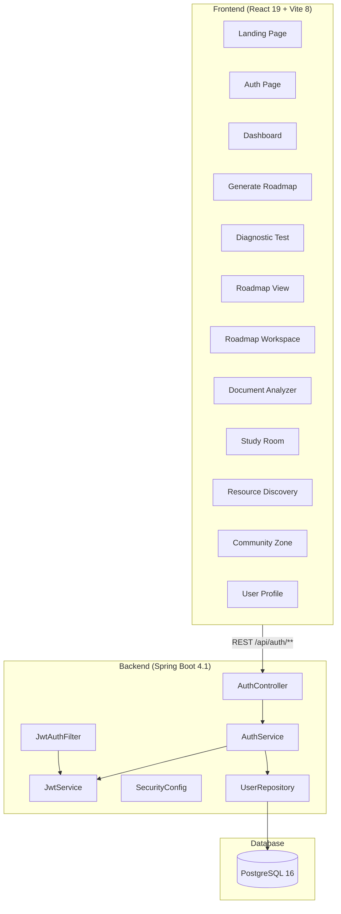

# StudyGen — Project Analysis

## Overview

**StudyGen** is a full-stack study/learning platform built with a **Spring Boot 4.1** backend and a **React 19 + Vite 8** frontend. It features JWT-based authentication, PostgreSQL persistence, and a rich set of planned learning features.

---

## Architecture



---

## Tech Stack

| Layer | Technology | Version |
|---|---|---|
| **Backend Framework** | Spring Boot | **4.1.0** |
| **Language** | Java | **21** |
| **Security** | Spring Security + JWT (jjwt) | **0.12.5** |
| **ORM** | Spring Data JPA / Hibernate | — |
| **Database** | PostgreSQL | **16** (Docker) |
| **Build Tool** | Maven (wrapper) | — |
| **Frontend Framework** | React | **19.2.7** |
| **Bundler** | Vite | **8.1.1** |
| **Routing** | React Router DOM | **7.18.2** |
| **Linter** | oxlint | **1.71.0** |
| **Code Gen** | Lombok | — |

---

## Backend Structure

```
com.asjad.studygen/
├── StudyGenApplication.java          # Entry point
├── config/
│   ├── SecurityConfig.java           # Spring Security filter chain, CORS, BCrypt
│   ├── JwtAuthFilter.java            # OncePerRequestFilter for Bearer tokens
│   └── UserDetailsServiceImpl.java   # Loads user by email for auth
├── controller/
│   └── AuthController.java           # POST /register, /login, GET /health
├── dto/
│   ├── RegisterRequest.java          # Validated record (fullName, email, password)
│   ├── LoginRequest.java             # Validated record (email, password)
│   └── AuthResponse.java             # Record (token, tokenType, userId, fullName, email)
├── entity/
│   └── User.java                     # JPA entity + UserDetails impl
├── exception/
│   └── GlobalExceptionHandler.java   # @RestControllerAdvice
├── repository/
│   └── UserRepository.java           # JpaRepository<User, Long>
└── service/
    ├── AuthService.java              # Register + login logic
    └── JwtService.java               # Token gen, validation, claims extraction
```

> [!TIP]
> The backend follows a clean **Controller → Service → Repository** layered architecture with proper separation of concerns. Good use of Java records for DTOs and Lombok for boilerplate reduction.

---

## Frontend Structure (12 Page Modules)

| Page | Route | Components | Status |
|---|---|---|---|
| **Landing Page** | `/` | HeroSection, FeaturesSection, StatsSection | ✅ Implemented |
| **Auth** | `/auth` | LoginForm, SignUpForm | ✅ Implemented |
| **Dashboard** | `/dashboard` | ActiveRoadmaps, QuickUploadWidget, StatsOverview, StreakHeatmap | 🟡 Scaffolded |
| **Generate Roadmap** | `/generate-roadmap` | GoalInputForm, JobDescriptionInput, PreferencesSelector | 🟡 Scaffolded |
| **Diagnostic Test** | `/diagnostic-test` | QuestionProgress, QuizCard, ScoreSummary | 🟡 Scaffolded |
| **Roadmap View** | `/roadmap-view` | D3GraphCanvas, ModulesList, RoadmapHeader | 🟡 Scaffolded |
| **Roadmap Workspace** | `/roadmap-workspace` | AIChatbotDrawer, ConceptExplanation, ConceptQuiz, FlashcardsDeck | 🟡 Scaffolded |
| **Document Analyzer** | `/document-analyzer` | FileUploader, DocumentSummary, GeneratedNotes | 🟡 Scaffolded |
| **Study Room** | `/study-room` | PomodoroTimer, AmbientAudioPlayer, ProductivityAnalytics | 🟡 Scaffolded |
| **Resource Discovery** | `/resources` | CategoryFilter, ResourceFeed, SavedLibrary | 🟡 Scaffolded |
| **Community Zone** | `/community` | ChannelSidebar, ChatWindow, PostThread | 🟡 Scaffolded |
| **User Profile** | `/profile` | ProfileHeader, EditProfileModal, ContributionGraph, SkillMatrixChart | 🟡 Scaffolded |

> [!NOTE]
> Most pages beyond Auth and Landing are **scaffolded** (small placeholder files ~200-600 bytes). The Auth flow (login/register) and Landing Page are the only fully implemented features.

---

## What's Working Well ✅

1. **Clean layered architecture** — Controller → Service → Repository with proper DI
2. **Modern Java records** for DTOs — immutable, concise, validated
3. **Proper JWT implementation** — HMAC-SHA signing, expiration handling, `OncePerRequestFilter`
4. **Bean validation** — `@NotBlank`, `@Email`, `@Size` on request DTOs
5. **Global exception handling** — `@RestControllerAdvice` catches validation + auth errors consistently
6. **Stateless sessions** — `SessionCreationPolicy.STATELESS` (correct for JWT)
7. **CORS configured** for the Vite dev server
8. **Password hashing** with BCrypt
9. **React auth context** — `AuthProvider` with localStorage persistence and `ProtectedRoute` wrapper
10. **Docker Compose** for quick PostgreSQL setup

---

## Issues & Risks ⚠️

### 🔴 Critical: Security

| Issue | Location | Details |
|---|---|---|
| **JWT secret committed to source** | [application.properties](file:///e:/Desktop/Fnl%20Year%20Project/StudyGen/src/main/resources/application.properties#L14) | The hex key `24927e1c...` is in version control. Should use env vars or a secrets manager. |
| **DB credentials committed** | [application.properties](file:///e:/Desktop/Fnl%20Year%20Project/StudyGen/src/main/resources/application.properties#L4-L5) | `user` / `StudyGen123` hardcoded. Use `${DB_PASSWORD}` env var references. |
| **CSRF disabled globally** | [SecurityConfig.java](file:///e:/Desktop/Fnl%20Year%20Project/StudyGen/src/main/java/com/asjad/studygen/config/SecurityConfig.java#L57) | Acceptable for a pure REST API with JWT, but document the rationale. |
| **No JWT exception handling in filter** | [JwtAuthFilter.java](file:///e:/Desktop/Fnl%20Year%20Project/StudyGen/src/main/java/com/asjad/studygen/config/JwtAuthFilter.java#L64-L65) | A malformed/expired token will throw an unhandled `JwtException`, resulting in a 500 instead of a clean 401. |

### 🟡 Moderate: Architecture & Code

| Issue | Location | Details |
|---|---|---|
| **No API service layer for protected endpoints** | [api.js](file:///e:/Desktop/Fnl%20Year%20Project/StudyGen/frontend/src/services/api.js) | Only has `loginUser` and `registerUser`. No generic `authFetch` helper that attaches the `Authorization: Bearer` header. Every future page will need this. |
| **No Vite proxy configured** | [vite.config.js](file:///e:/Desktop/Fnl%20Year%20Project/StudyGen/frontend/vite.config.js) | Frontend calls `http://localhost:8080` directly. Should use a Vite dev proxy to avoid CORS issues in development and make production deploys simpler. |
| **`docker-compose.yml` uses deprecated `version` key** | [docker-compose.yml](file:///e:/Desktop/Fnl%20Year%20Project/StudyGen/docker-compose.yml#L1) | `version: '3.8'` is deprecated in modern Docker Compose. Remove it. |
| **No backend tests** | `src/test/` | Test directory exists but likely only has the auto-generated context test. No service/controller tests. |
| **Junk file in frontend** | `frontend/codfiasjdfoasfoi.txt` | Appears to be accidental — should be deleted or gitignored. |
| **Inconsistent file casing** | `frontend/src/pages/` | `landingpage/` (lowercase) vs `Dashboard/` (PascalCase). Pick one convention. |
| **Navbar/Footer render on all routes** | [App.jsx](file:///e:/Desktop/Fnl%20Year%20Project/StudyGen/frontend/src/App.jsx#L24-L39) | Navbar and Footer show on the Auth page and Landing page too — probably not intended. Use layout routes to control this. |

### 🟢 Minor: Polish

| Issue | Details |
|---|---|
| No `application-dev.properties` / `application-prod.properties` | Consider Spring profiles for environment-specific config. |
| `ddl-auto=update` in properties | Fine for dev, but dangerous in production — should be `validate` or `none`. |
| No `.env.example` file | No documentation of required environment variables for new developers. |
| No Swagger/OpenAPI | Consider `springdoc-openapi` for auto-generated API docs. |

---

## Recommendations — Prioritized Roadmap

### Phase 1: Fix Critical Issues (Do Now)
1. **Externalize secrets** — move JWT secret and DB credentials to environment variables
2. **Add try-catch in `JwtAuthFilter`** — catch `JwtException` and return 401
3. **Create an `authFetch` utility** in the frontend that auto-attaches the Bearer token

### Phase 2: Developer Experience (This Week)
4. **Add a Vite dev proxy** to `/api` → `localhost:8080`
5. **Add Spring profiles** — `dev` vs `prod` properties files
6. **Set up `springdoc-openapi`** for API documentation
7. **Clean up** — delete junk file, standardize page folder casing
8. **Add layout routes** — separate layouts for public vs authenticated pages

### Phase 3: Feature Buildout (Next Sprint)
9. **Build backend controllers/services** for the scaffolded features (Roadmap, Study Room, etc.)
10. **Add database migration tool** — Flyway or Liquibase instead of `ddl-auto=update`
11. **Wire up the frontend pages** to real API endpoints
12. **Add unit & integration tests** — at minimum for AuthService and JwtService

### Phase 4: Production Readiness
13. **Add rate limiting** on auth endpoints
14. **Implement refresh token rotation**
15. **Add logging framework** (SLF4J + Logback structured logging)
16. **CI/CD pipeline** — GitHub Actions for build + test
17. **Dockerize the full app** — multi-stage Docker build for backend + frontend

---

## Summary

StudyGen has a **solid foundation** — the auth flow is well-architected with proper Spring Security + JWT integration, clean layered Java code, and a well-structured React frontend. The main gaps are:

- **Security hygiene** (secrets in source control, unhandled JWT errors)
- **Feature completeness** (10 of 12 pages are empty scaffolds)
- **Missing infrastructure** (tests, API docs, CI/CD, proper env management)

The project is in a good position for a final year project — the core patterns are correct, and most of the remaining work is feature implementation following the established patterns.
